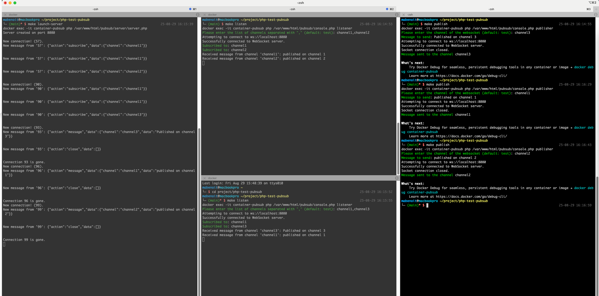

# Test pubsub with Websocket and PHP

## Prerequisite
Install make and docker

## Setup the environment
- launch "make docker-init"  
- launch "make project-init"  
- launch "make launch-server"  

## Listen and Publish
Terminal 1:
- type "make listen"  

Terminal 2:
- type "make publish"

